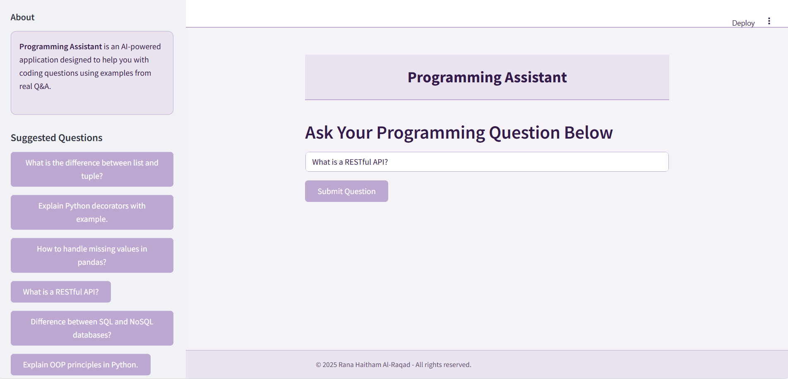
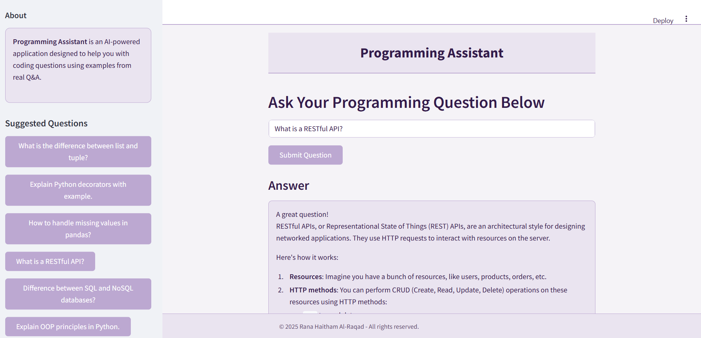

# 🤖 Programming Assistant (LLM + RAG + FastAPI + Streamlit)
This project is an AI-powered programming assistant designed to help users understand StackOverflow questions and answers more effectively.

## 💡 Project Idea
The core idea is to build an intelligent assistant that can answer programming questions. Instead of just relying on a general-purpose LLM, this project enhances the model's responses by first retrieving similar questions and answers from the preprocessed StackOverflow dataset. This Retrieval-Augmented Generation (RAG) approach provides more specific and relevant context to the LLM, leading to better quality answers.

##  Features
*   **AI-Powered Answers:** Leverages a Large Language Model (LLM - llama3:instruct) to provide context-aware answers based on relevant StackOverflow data.
*   **RAG Architecture:** Uses Retrieval-Augmented Generation (RAG) to find relevant Q&A examples from a ChromaDB vector store before generating the final answer.
*   **Interactive Interfaces:** Offers both a web-based Streamlit application and a FastAPI endpoint for interaction.

  
## 📊 Data Source & Preprocessing
### About the Dataset
The project utilizes a dataset containing the text of questions and answers from the Stack Overflow programming Q&A website. This dataset is organized into three tables:
*   **Questions**
*    **Answers**
*    **Tags**
*   **Dataset Link:** [StackSample: 10% of Stack Overflow Q&A on Kaggle](https://www.kaggle.com/datasets/stackoverflow/stacksample?select=Questions.csv) 

### Preprocessing Steps
The raw data from Questions.csv, Answers.csv, and Tags.csv underwent the following preprocessing:

1.   **HTML Cleaning:** Removed HTML tags from question titles/bodies and answer bodies using BeautifulSoup.
2.   **Dropping Nulls:** Removed rows with missing essential data (body, title).
3.   **Filtering by Score:** Kept only questions and answers with a score greater than 5 to focus on higher-quality content.
4.   **Merging Data:** Merged the filtered questions and answers datasets based on question IDs (ParentId` in Answers, Id in Questions).
5.   **Grouping Tags:** Grouped tags associated with each question ID.
6.   **Adding Tags:** Merged the grouped tags with the main dataframe.
7.   **Final Selection:** Sorted the merged data by answer score (descending) and selected the top entries (e.g., 5000) to create the final cleaned_stackoverflow.csv dataset used for embedding.

## 🛠️ Technologies Used
*   **Programming Language:** Python 
*   **Core Frameworks:**
    *   **LangChain:** Used for orchestrating the RAG pipeline (prompt templates, LLM interaction, retriever integration).
    *   **Ollama (llama3:instruct):** The Large Language Model used for generating answers. 🧠
    *   **ChromaDB:** Vector database used to store StackOverflow Q&A embeddings and enable efficient retrieval. 💾
    *   **FastAPI:** Framework used to build the backend API endpoint (/ask) for programmatic access. ⚡
    *   **Streamlit:** Framework used to create the interactive web application interface. 
*   **Embeddings:** `mxbai-embed-large` via Ollama for creating vector representations of the text data.
*   **Architecture:** Retrieval-Augmented Generation (RAG) - The system first retrieves relevant documents (Q&A pairs) from ChromaDB based on the user's query and then feeds these documents along with the query to the LLM (llama3:instruct) to generate a final, context-rich answer.

##  Architecture
1. User submits a programming question.
2. The system retrieves related questions and answers from ChromaDB.
3. The LLM uses this context to generate a rich, helpful response.

## 📺 Deployment & Results

- **Streamlit App:** [Live App Link](#)
- **Example Results:**

###  Example 1: User Question Input
  
*A screenshot showing the question input interface.*

###  Example 2: Generated Answer Output
  
*A screenshot showing the AI-generated answer based on retrieved context.*

